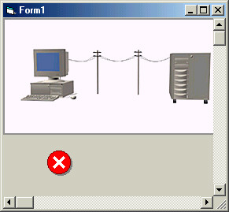



## Scroll a Form uing its own ScrollBars

### Description

This simple example shows you how to use the FORMS very own scrollbars. No need to use pictureboxes and added horizontal and vertical scrollbars adjacent to it to allow display of a form larger than the screen. This could get quite messy. And yes, the Form does have its very own scrollbars. Take a look at the screen shot and also run the example.

A couple of APIs do most of the work for you
 
### More Info
 
Most VB programmers do not realize the Form has scrollbars and consequently create elaborate methods for displaying forms that are larger than the physical screen. This example shows how to use the Forms scrollbars using a couple of simple API's.

Controls such as Lines and Shapes, or for that matter any control that does not have a hwnd, will need to be repainted when scrolled out of view and back in again. A simple way around this is to put those controls in pictureboxes with AutoRedraw = True.

             |
---                |---
**Submitted On**   |2002-04-14 16:39:02
**By**             |[John G](https://github.com/Planet-Source-Code/PSCIndex/blob/master/ByAuthor/john-g.md)
**Level**          |Advanced
**User Rating**    |5.0 (60 globes from 12 users)
**Compatibility**  |VB 6\.0
**Category**       |[Windows API Call/ Explanation](https://github.com/Planet-Source-Code/PSCIndex/blob/master/ByCategory/windows-api-call-explanation__1-39.md)
**World**          |[Visual Basic](https://github.com/Planet-Source-Code/PSCIndex/blob/master/ByWorld/visual-basic.md)
**Archive File**   |[Scroll\_a\_F719474142002\.zip](https://github.com/Planet-Source-Code/john-g-scroll-a-form-uing-its-own-scrollbars__1-33806/archive/master.zip)

### API Declarations

Several. See the accompanying Module.

